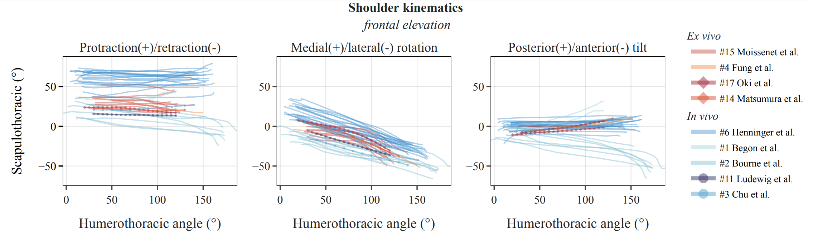

# Introduction
Gathering all the literature on shoulder kinematics, and scapulo-humeral rhythm
With this repository, We aim to gather all the literature on shoulder kinematics, and scapulo-humeral rhythm.
We will update the repo once submitted, in a journal. But this work has already been presented at:

- SOFAMEA 2024, Nantes, France
- ISG 2024, Toronto, Canada

Upcoming Talks:
- SB 2024, St Etienne, France

# A first Comparison

We aim to deliver the curves for all joints and more movements in the near future. Stay tuned!

# Still a work in progress but citable
Stay tuned...