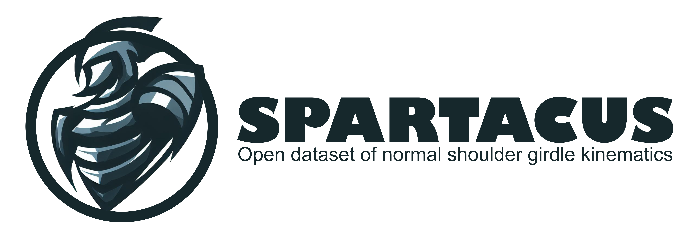
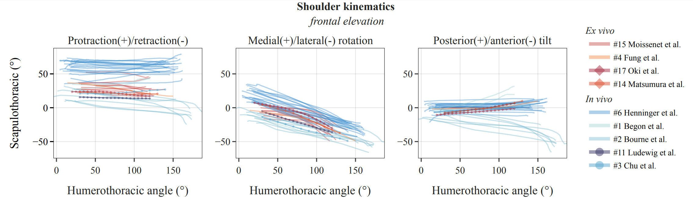

<p align="center" width="100%">

</p>

# Introduction
With this repository, we aim to gather all reference data collections (i.e. bone pins and 3D imaging) related to the whole shoulder girdle kinematics.
We will update the repo once the work will be submitted to a journal. But this work has already been presented at:
- SOFAMEA 2024, Nantes, France
- ISG 2024, Toronto, Canada

Upcoming talks:
- SB 2024, Compiègne, France

# A first comparison
<p align="center" width="100%">

</p>

We aim to deliver the curves for all degree-of-freedom, joints, and standardised arm motions in the near future.

Stay tuned!

# Still a work in progress but citable
Moissenet, F., Puchaud, P., Naaïm, A., Holzer, N., & Begon, M. (2024). Spartacus-shoulder-kinematics-dataset/shoulder-kinematics congress (0.1.0). Zenodo. https://doi.org/10.5281/zenodo.11455521

```
@software{moissenet_2024_11455521,
  author       = {Moissenet, Florent and
                  Puchaud, Pierre and
                  Naaïm, Alexandre and
                  Holzer, Nicolas and
                  Begon, Mickael},
  title        = {{Spartacus-shoulder-kinematics-dataset/shoulder- 
                   kinematics congress}},
  month        = jun,
  year         = 2024,
  publisher    = {Zenodo},
  version      = {0.1.0},
  doi          = {10.5281/zenodo.11455521},
  url          = {https://doi.org/10.5281/zenodo.11455521}
}
```
